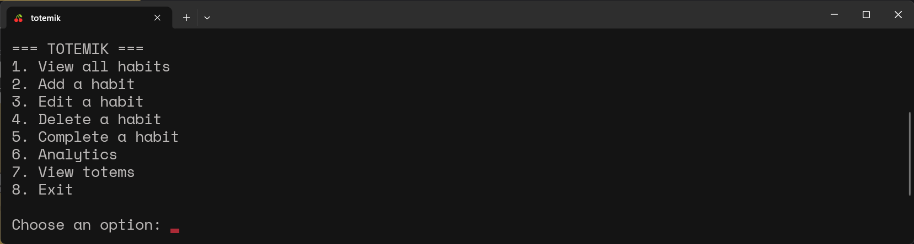
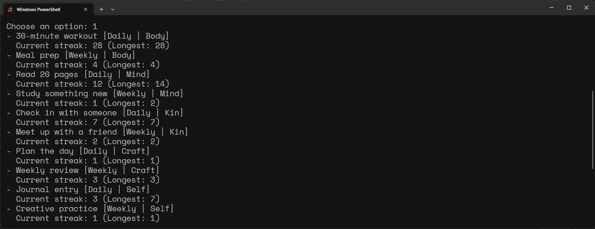
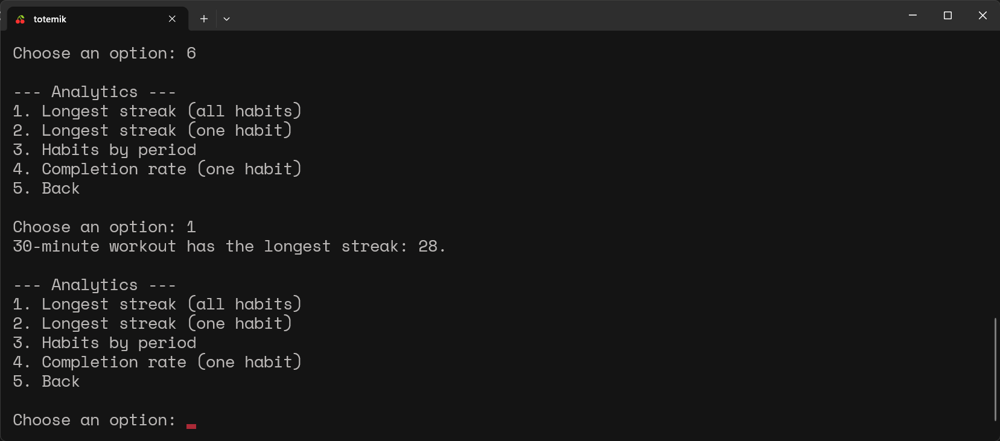
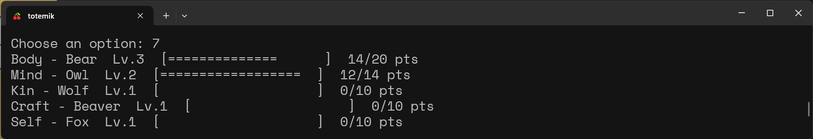
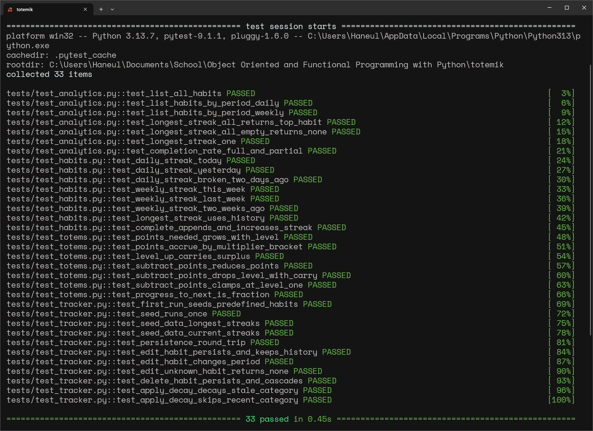

# Totemik

Totemik is a command-line habit tracker. You manage habits through a numbered
menu in the terminal, and the data is kept in a local SQLite database so it
persists between sessions. The app is delivered with ten predefined habits and
four weeks of example completions, so the first run already has data to explore.

Each habit belongs to one of five categories: Body, Mind, Kin, Craft, and Self.
Every category has a totem that gains levels as you complete its habits and
loses points when habit completions stop.

## Requirements

- Python 3.8 or newer
- pytest, needed only to run the tests

No other third-party libraries are used.

## Install

Clone the repository. If you want an isolated environment, create a virtual
environment as well:

    git clone <repository-url>
    cd Totemik
    python -m venv .venv
    source .venv/bin/activate        # Windows: .venv\Scripts\activate

Install pytest if you plan to run the tests:

    pip install pytest

## Run

    python main.py

The database file `habits.db` is created in the project root on first run.

## Using Totemik

Starting the app prints the main menu:

    === TOTEMIK ===
    1. View all habits
    2. Add a habit
    3. Edit a habit
    4. Delete a habit
    5. Complete a habit
    6. Analytics
    7. View totems
    8. Exit

Type the number for what you want and press Enter. Most actions then ask some
follow-up questions. Option 8 saves and closes.

### Creating a habit

Choose option 2. The app asks for three things in turn:

1. **Name.** Any text, as long as it is not empty and not already taken. A name
   that is already in use is rejected.
2. **Period.** Either `daily` or `weekly`. Anything else is refused.
3. **Category.** One of Body, Mind, Kin, Craft, or Self. Capitalisation does
   not matter, so `body` and `Body` both land in the Body category.

Once the three answers pass, the habit is written to the database and is ready
to use. It starts with no completions and a streak of zero.

### Editing a habit

Choose option 3 and type the name of the habit you want to change. The app then
asks for a new name, period, and category in turn, showing the current value in
brackets. Leave a field blank to keep it as it is, so you can change just the
category without retyping the rest. The same rules as creating a habit apply: a
new name must be free, the period must be `daily` or `weekly`, and the category
must be one of the five. The habit keeps its completion history, so editing a
habit never resets its streak.

### Completing a habit

Choose option 5 and type the name of the habit exactly as it appears under
option 1. The app stamps the completion with the current date and time, then
adds points to that habit's category totem for the current run. If the name
matches no habit, it tells you and nothing changes.

Completing the same daily habit twice in one day counts once toward the streak,
and the same goes for a weekly habit completed twice in one week.

### Predefined habits

The first run loads these ten habits, one daily and one weekly per category,
each carrying example completions spread across the previous four weeks:

| Habit | Period | Category |
|---|---|---|
| 30-minute workout | daily | Body |
| Meal prep | weekly | Body |
| Read 20 pages | daily | Mind |
| Study something new | weekly | Mind |
| Check in with someone | daily | Kin |
| Meet up with a friend | weekly | Kin |
| Plan the day | daily | Craft |
| Weekly review | weekly | Craft |
| Journal entry | daily | Self |
| Creative practice | weekly | Self |

### Analytics and totems

Option 6 opens a second menu with four reports: the longest streak across all
habits, the longest streak for one habit you name, the habits filtered by
period, and the 30-day completion rate for one habit.

Option 7 shows each category's totem, showing the level, a progress bar,
and the current points toward the next level.

## Screenshots

The main menu:

Every habit with its current and longest streak:

The analytics submenu, here reporting the longest streak across all habits:

Each category drawn as its totem, with level and progress:

## Tests

    python -m pytest

The suite covers the habit and streak logic, the analytics functions, the totem
points and decay, and the database round trip. The streak logic is also checked
against the four weeks of predefined data, whose completion patterns imply known
longest and current streaks.

The full suite passing:

